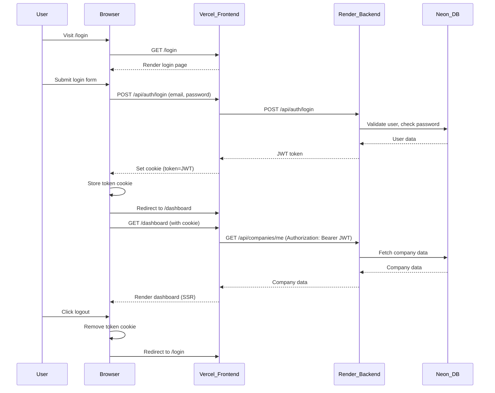

# Architecture Overview

## API Design
- **RESTful endpoints** for authentication, company, tender, application, and search.
- **Modular routing** in Express: `/api/auth`, `/api/companies`, `/api/tenders`, `/api/applications`, `/api/search`.
- **Input validation** using Zod.
- **Consistent error handling** with proper status codes and error middleware.

## Authentication Flow
1. **Sign Up / Sign In**: Users register and log in with email and password.
2. **Password Hashing**: Passwords are hashed using bcryptjs before storing in the database.
3. **JWT Issuance**: On successful login, a JWT is issued and must be sent in the `Authorization` header for protected endpoints.
4. **JWT Verification**: Middleware checks JWT for protected routes, attaches user info to the request.
5. **User-Company Mapping**: Users are mapped to companies via the `user_company_map` table (many-to-many support).

## Storage Integration
- **Neon Postgres** is used for all structured data: users, companies, tenders, applications, and all business logic data.
- **Supabase Storage** is used only for company logos/images (file uploads).
- Backend uses `@supabase/supabase-js` to upload and retrieve image URLs from Supabase Storage.
- Logo URLs are constructed dynamically from Supabase; not stored in the DB.
- Credentials for Supabase are stored in backend `.env` file.
- **Row Level Security (RLS)** is enabled on Supabase Storage; policies must allow authenticated uploads/reads.

## Frontend
- **Next.js** with SSR/SSG for fast, SEO-friendly pages.
- **Material-UI (MUI)** for modern, responsive UI.
- All API calls send JWT in the Authorization header.
- All forms and lists use MUI components for accessibility and UX.

## Example Endpoint Structure
- `POST /api/auth/signup` — Register new user
- `POST /api/auth/login` — Login and receive JWT

- `GET /api/companies/:id` — Get company profile
- `GET /api/companies/me` — Get current user's company profile
- `POST /api/companies` — Create or update company profile
- `POST /api/companies/:id/logo` — Upload company logo (Supabase)
- `DELETE /api/companies/:id` — Delete company

- `GET /api/tenders` — List all tenders (paginated)
- `GET /api/tenders/:id` — Get tender details
- `GET /api/tenders/company/:companyId` — List tenders for a company
- `POST /api/tenders` — Create tender
- `PUT /api/tenders/:id` — Update tender
- `DELETE /api/tenders/:id` — Delete tender

- `POST /api/applications` — Apply to tender
- `GET /api/applications/tender/:tenderId` — Get all applications for a tender
- `GET /api/applications/company/:companyId` — Get all applications for a company

- `GET /api/search/companies` — Search companies by name, industry, or products/services

## Security
- All sensitive endpoints require JWT authentication.
- Input validation and error handling throughout.
- CORS enabled for frontend-backend communication.
- **Supabase Storage RLS**: Policies must be set to allow authenticated users to upload/read/update/delete in the `company-logos` bucket.

## Troubleshooting
- **Supabase RLS errors**: Check your storage policies if uploads fail.
- **PayloadTooLargeError**: Increase Express JSON body limit if uploading images.

## User Authentication & SSR Sequence

The following diagram illustrates the user login, cookie-based JWT auth, and SSR flow for protected pages:

**Key Points:**
- JWT is stored as a cookie and used for SSR and API calls.
- All protected pages use SSR (`getServerSideProps`) to check auth and fetch data.
- Data is always fetched server-side for protected pages, ensuring security and up-to-date content. 