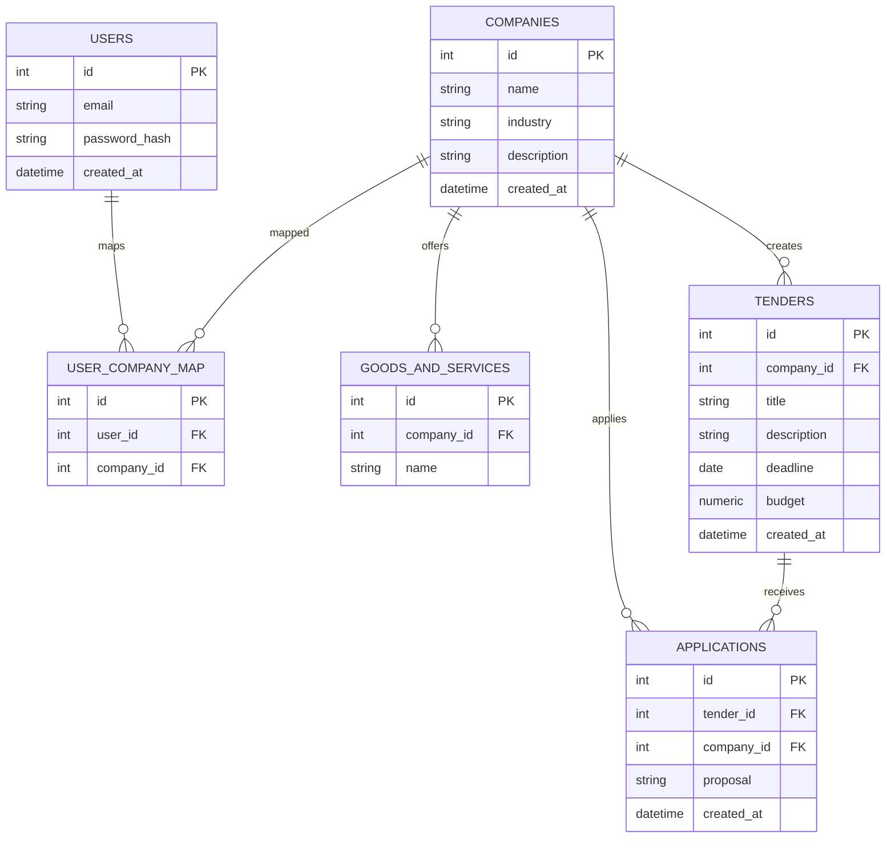

# Entity Relationship Diagram (ERD)

```mermaid
erDiagram
    USERS ||--o{ USER_COMPANY_MAP : maps
    COMPANIES ||--o{ USER_COMPANY_MAP : mapped
    COMPANIES ||--o{ GOODS_AND_SERVICES : offers
    COMPANIES ||--o{ TENDERS : creates
    COMPANIES ||--o{ APPLICATIONS : applies
    TENDERS ||--o{ APPLICATIONS : receives

    USERS {
      int id PK
      string email
      string password_hash
      datetime created_at
    }
    USER_COMPANY_MAP {
      int id PK
      int user_id FK
      int company_id FK
    }
    COMPANIES {
      int id PK
      string name
      string industry
      string description
      datetime created_at
    }
    GOODS_AND_SERVICES {
      int id PK
      int company_id FK
      string name
    }
    TENDERS {
      int id PK
      int company_id FK
      string title
      string description
      date deadline
      numeric budget
      datetime created_at
    }
    APPLICATIONS {
      int id PK
      int tender_id FK
      int company_id FK
      string proposal
      datetime created_at
    }
``` 